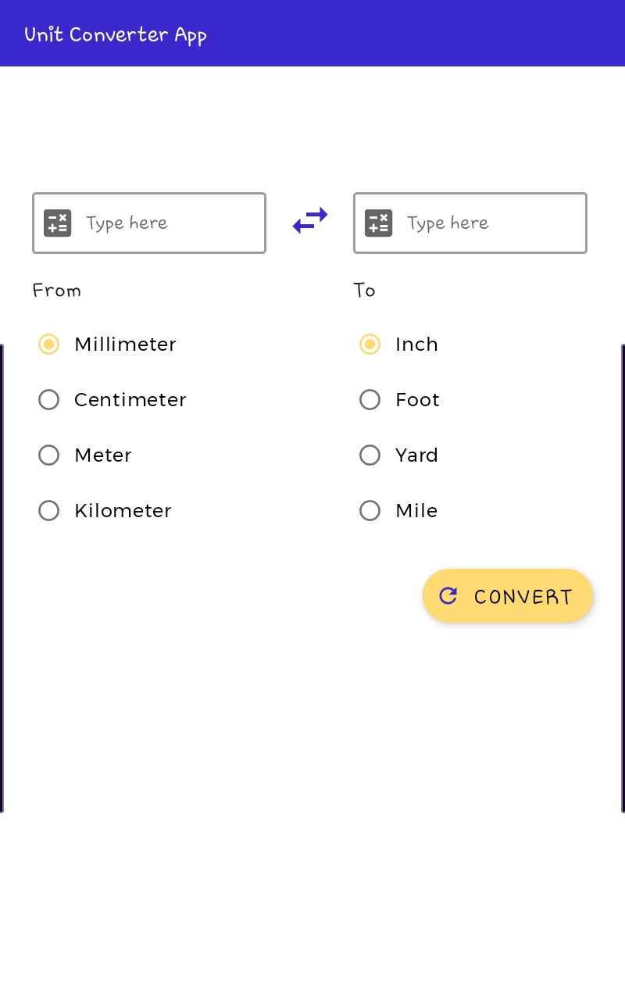

# Unit Converter App
An app to convert the standard units of measurements to other less used units

## Description

***Convert (millimeter, centimeter, meter, kilometer) to (inch, foot, yard, mile)***
* Type in the value
* Pick the unit you want to convert from
* Pick the unit you want to convert to
* Hit 'CONVERT' !
* Tap the 'switch' button in between the textfield to change where you input the text

## Note
**This personal project was done after the completion of Pathway 2, Unit 2: Layouts, Android Basics in Kotlin**

## Screenshots
**Main Screen**
--

